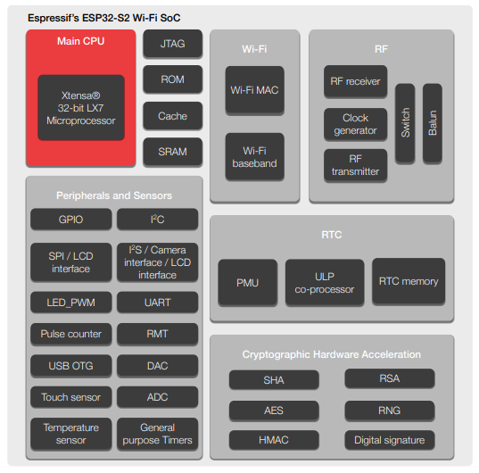

# [ESP32-S2](https://github.com/SoCXin/ESP32-S2)

* [Espressif](https://www.espressif.com/): [Xtensa LX7](https://github.com/SoCXin/MIPS)
* [L5R4](https://github.com/SoCXin/Level): 240 MHz (150DMIPS/398CoreMark)

### [简介](https://github.com/SoCXin/ESP32-S2/wiki)

[ESP32-S2](https://github.com/SoCXin/ESP32-S2) 是一款安全可靠的低功耗、高集成 2.4 GHz Wi-Fi 系统级芯片 (SoC)，支持 Wi-Fi HT40 和多达 43 个 GPIO。仍然沿用了乐鑫已经非常成熟的软件开发框架 ESP-IDF。

#### 关键参数

* Xtensa® 32-bit LX7 单核处理器，7 级流水线架构，时钟频率高达 240 MHz
* 320 KB SRAM，128 KB ROM，16 KB RTC 内存
* 最大可支持 1 GB 外部 flash and SRAM
* 支持 HT40，数据速率高达 150 Mbps
* 支持全速 USB OTG
* 支持 8-/16-bit DVP 图像传感器接口，最高时钟频率支持到 40 MHz
* 43 个 GPIO
* 工作温度是 -40 °C~125 °C

### [资源收录](https://github.com/SoCXin)

* [参考资源](src/)
* [参考文档](docs/)
* [参考工程](project/)

### [资源收录](https://github.com/SoCXin/ESP32-S2)

软件开发采用[ESP-IDF](https://docs.espressif.com/projects/esp-idf/en/latest/get-started/index.html)工具框架

### [选型建议](https://github.com/SoCXin/ESP32-S2)

[ESP32-S2](https://github.com/SoCXin/ESP32-S2) 可作为[ESP32](https://github.com/SoCXin/ESP32) 和[ESP8266](https://github.com/SoCXin/ESP8266)间的升级方案，补足了之前的短板，沿用了成熟的软件体系。

* 封装：QFN56 7x7

### [探索芯世界 www.SoC.xin](http://www.SoC.Xin)
