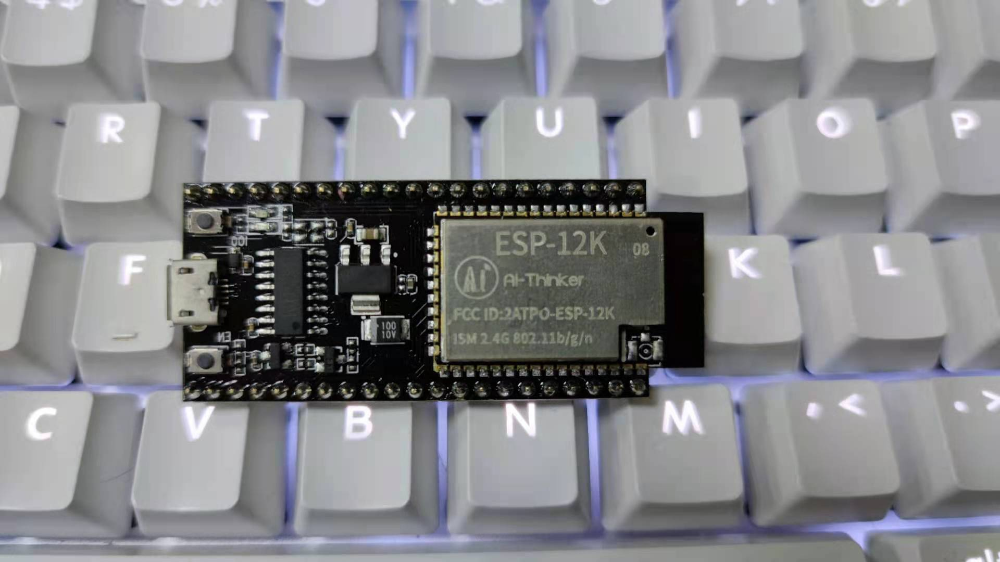

# [ESP32-S2](https://github.com/SoCXin/ESP32-S2)

* [Espressif](https://www.espressif.com/): [Xtensa LX7](https://github.com/SoCXin/MIPS)
* [L5R4](https://github.com/SoCXin/Level): 240 MHz x 2.5 DMIPS/MHz (330CoreMark)

### [xin简介](https://github.com/SoCXin/ESP32-S2/wiki)

[ESP32-S2](https://github.com/SoCXin/ESP32-S2) 是一款安全可靠的低功耗、高集成 2.4 GHz Wi-Fi 系统级芯片 (SoC)，支持 Wi-Fi HT40 和多达 43 个 GPIO。仍然沿用了乐鑫已经非常成熟的软件开发框架 ESP-IDF。

#### 关键参数

* 320 KB SRAM，128 KB ROM，16 KB RTC
* 1 GB external flash
* HT40 150 Mbps
* USB OTG FS
* 40 MHz 8-/16-bit DVP
* -40 °C~125 °C

### [xin资源](https://github.com/SoCXin)

* [参考资源](src/)
* [相关文档](docs/)
* [典型应用](project/)
* [入门教程](https://docs.soc.xin/ESP32-S2)

### [选型建议](https://github.com/SoCXin/ESP32-S2)

[ESP32-S2](https://github.com/SoCXin/ESP32-S2) 在[ESP32](https://github.com/SoCXin/ESP32) 基础上主要移除了蓝牙，增加了USB OTG。

#### xin规格

* QFN56 (7x7mm)

### 验证开发板

#### 高可用度开源项目

* [ESP-IDF](https://github.com/espressif/esp-idf)

### [探索芯世界 www.SoC.xin](http://www.SoC.Xin)
